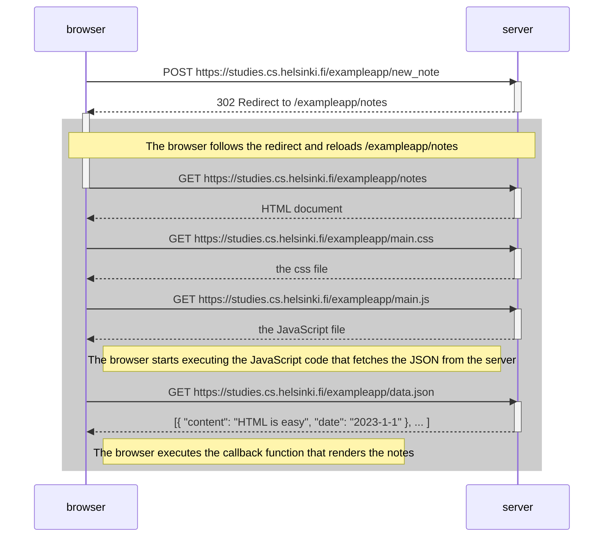
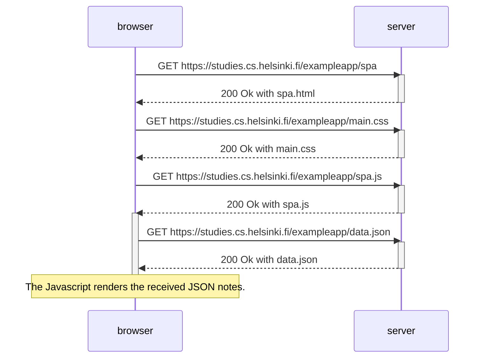
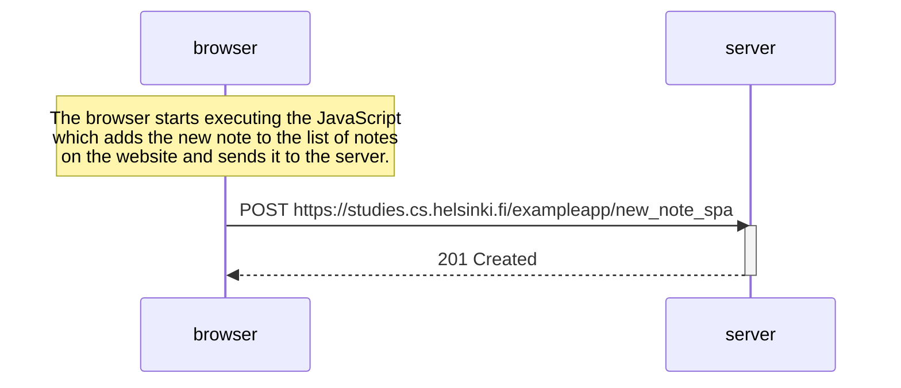

# Exercises Part 0

- [x] Exercise 0.4 Create a sequence diagram using Mermaid syntax for submitting form

- [x] Exercise 0.5 Create a sequence diagram using Mermaid syntax for loading single page app

- [x] Exercise 0.6 Create a sequence diagram using Mermaid syntax for sending note from single page app

